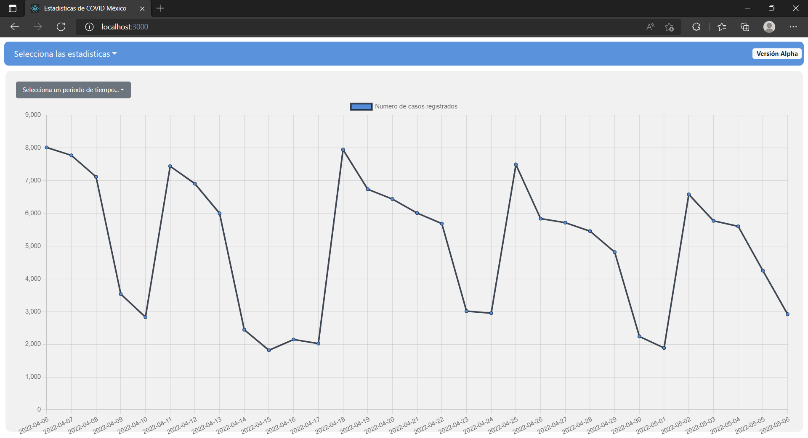
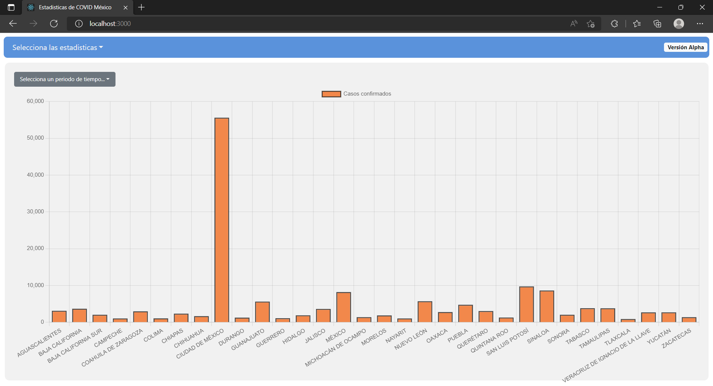
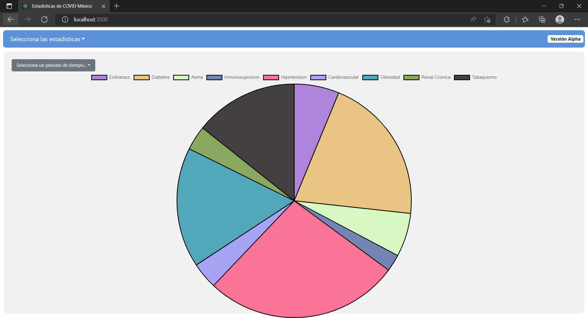

# COVID-MX-STATS / Estadisticas de COVID en México
## About
COVID-MX-STATS is a project which only objective is to show the COVID data in easy to understand charts.

This project is open source, so feel free to clone, modify and make pull requests!
## Screenshots



## Usage
**Back-end** - To start the development server
```
cd server; npm run dev
```
**Back-end** - To start prod server
```
cd server; npm run start
```
**Front-end** - To start a live server for the React app
```
npm run start
```
**Front-end** - To build the React app and deploy to an extern host/service
```
npm run build
```
### Atention
-  Postgres information should be updated inside [`server/index.js`](server/index.js) where dbClient is declared, otherwise it will never make any connection to the Postgres server/db.
- To create the required Database you can use the script [`server/database.sql`](server/database.sql)

To fill the database with the latest data about covid download the database content in csv format from the [official government site](https://www.gob.mx/salud/documentos/datos-abiertos-152127). Move the file to the server folder and rename it to COVID19MEXICO.csv, and then run the next command.
```
cd server; npm run fill-db
```


---
The data about COVID shown in this project is given by the Mexico's government on its open data site. I don't own any of that information.